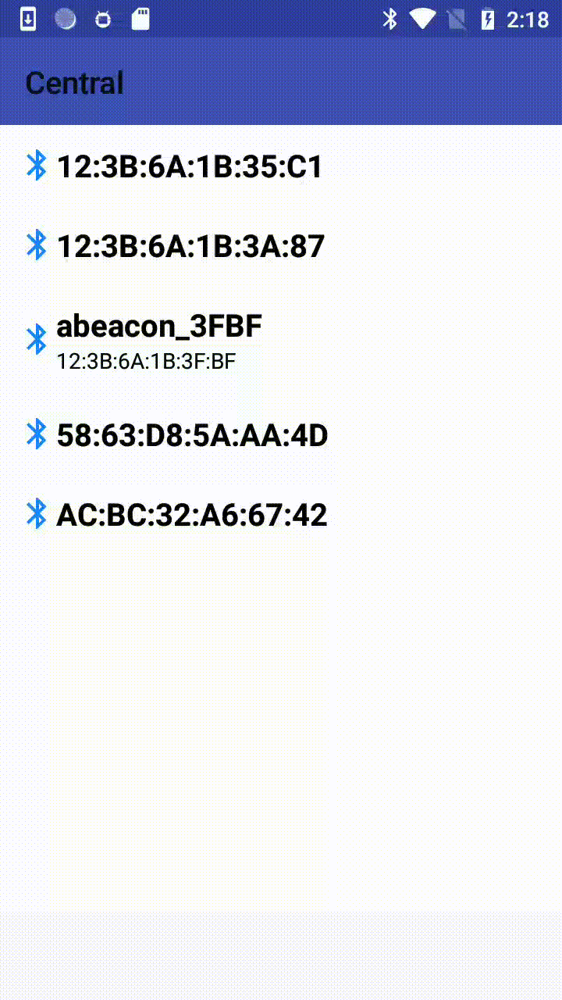

# BluetoothExplorer

Bluetooth Explorer iOS & Android App

## Requirements

### Android

Install [Android Swift Toolchain](https://github.com/SwiftJava/android_toolchain) and then compile from Android Studio.

## iOS

Fetch dependencies with [Carthage](https://github.com/Carthage/Carthage)

```
carthage bootstrap --no-build
```

### 



